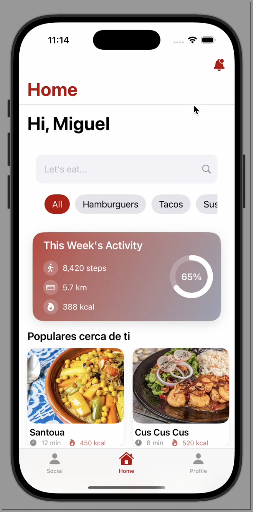
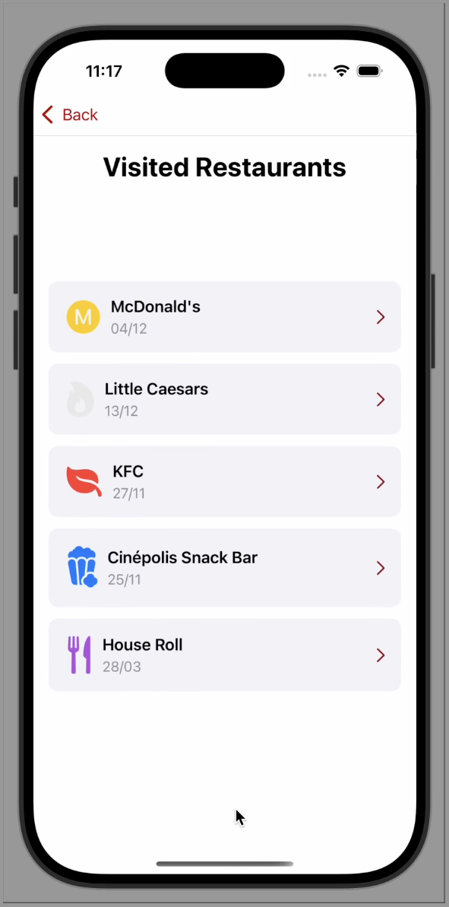
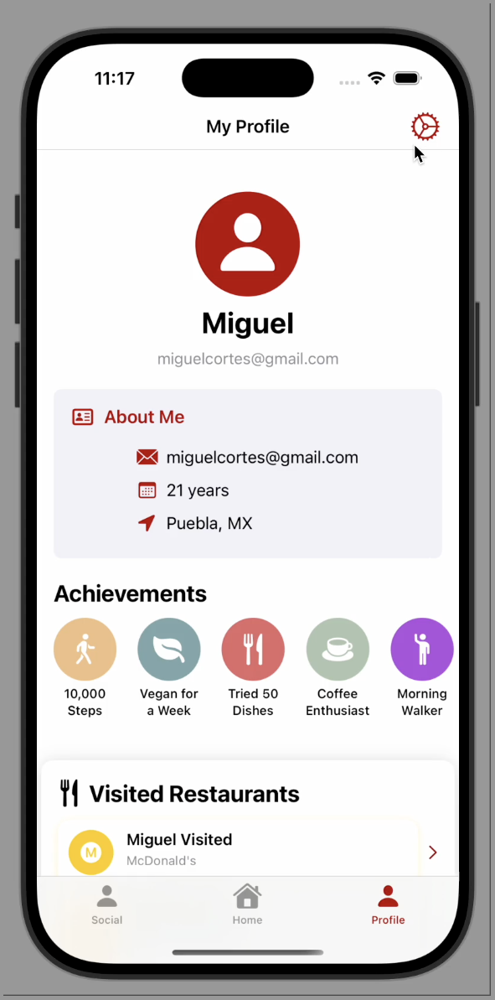
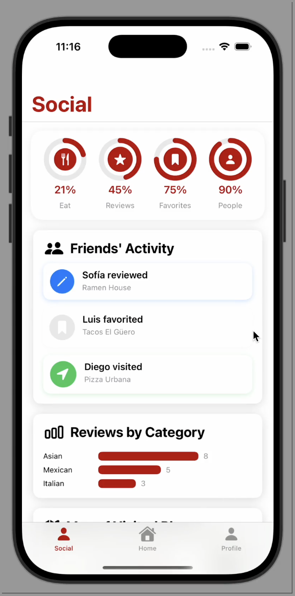
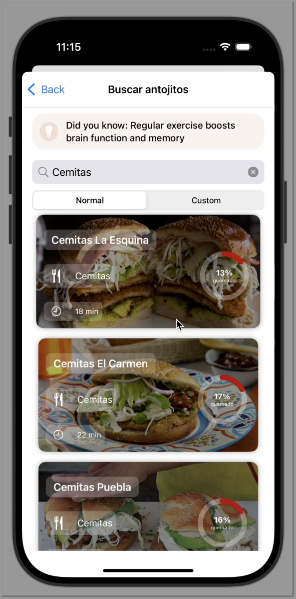
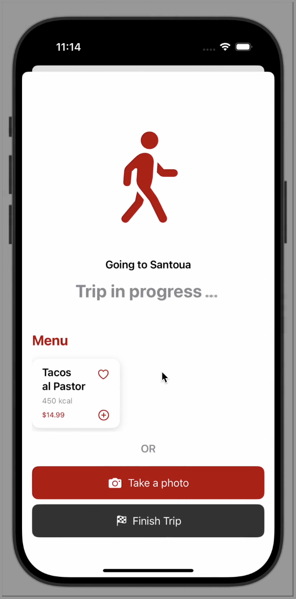
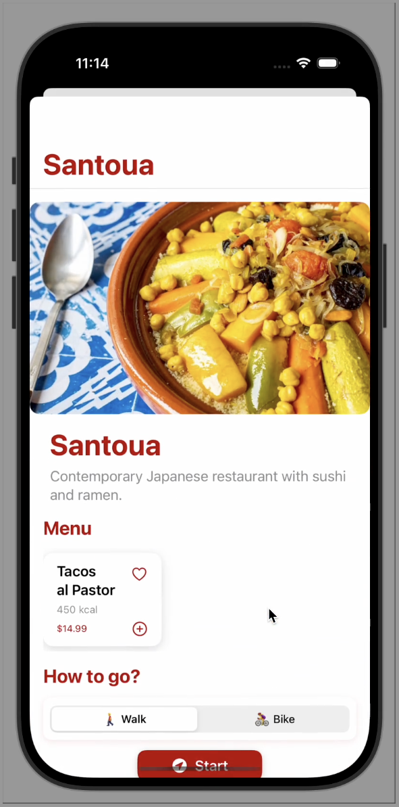
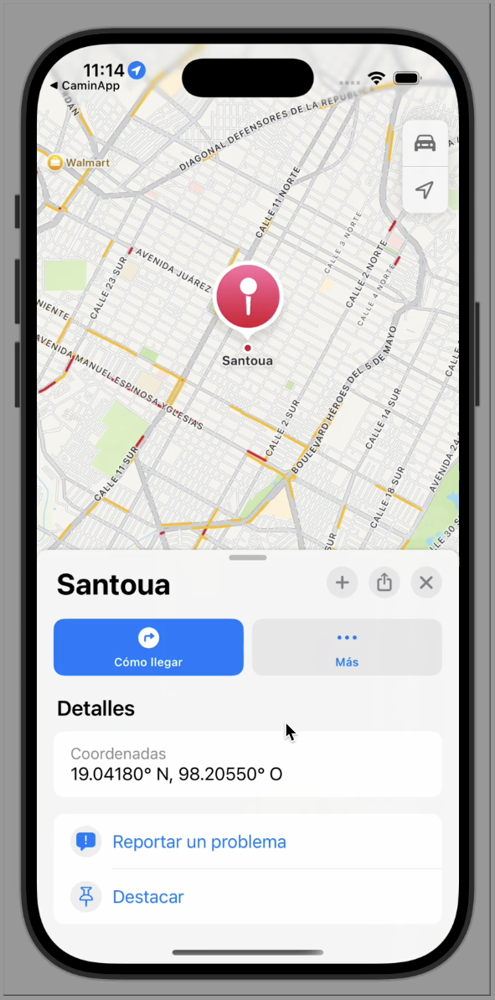

# Antojo Activo (CaminaApp) 🥗🚶‍♀️

> **Discover restaurants based on your cravings while staying active!** Antojo Activo shows you how many calories you'll burn walking or biking to your destination and compares it to your meal's calories.

**🏆 Built during a local iOS Hackathon** | **🥇 Winner Project**


## 📱 Screenshots

<table>
  <tr>
    <td><br/><b>Home</b></td>
    <td><br/><b>Visited</b></td>
    <td><br/><b>Profile</b></td>
    <td><br/><b>Social</b></td>
  </tr>
  <tr>
    <td><br/><b>Search</b></td>
    <td><br/><b>Trip</b></td>
    <td><br/><b>Restaurant</b></td>
    <td><br/><b>Map</b></td>
  </tr>
</table>

---

## 🎯 Key Features

### 🔐 Authentication & Profile
- Firebase Authentication with email/password
- User profile with personal metrics (age, height, weight)
- Achievement tracking and visited places

### 🔍 Discovery & Search
- Smart search by restaurant name or food type
- Category filtering for quick browsing
- Interactive map with nearby restaurants

### 🗺️ Maps & Navigation
- Real-time location tracking
- Apple Maps integration for directions
- Distance and estimated walking/biking time

### 🍽️ Restaurant Experience
- Detailed restaurant information and menu
- Trip tracking (start, in-progress, summary)
- Camera integration for food photos
- Calorie comparison: burned vs consumed

### 👥 Social Features
- Activity feed with friends' visits
- Achievement badges
- Restaurant reviews and ratings

---

## 🛠️ Tech Stack

**Frontend**
- SwiftUI 
- MapKit & CoreLocation for maps and location services
- AVFoundation for camera functionality

**Backend & Services**
- Firebase Authentication
- Firebase Realtime Database
- CocoaPods for dependency management

**Additional Frameworks**
- Charts for data visualization
- Reality Composer (AR assets prepared, not yet integrated)

---

## 🚀 Getting Started

### Prerequisites
- Xcode 15+
- iOS 16+
- CocoaPods installed

### Installation

1. **Clone the repository**
```bash
git clone https://github.com/zepedag/HackatoniOS.git
cd HackatoniOS
```

2. **Install dependencies**
```bash
pod install
```

3. **Open the workspace**
```bash
open CaminaApp.xcworkspace
```

4. **Configure Firebase**
   - Ensure `GoogleService-Info.plist` is in the project root
   - Verify the Bundle ID matches your Firebase app configuration

5. **Run the app**
   - Select the "CaminaApp" scheme
   - Run on a device or simulator (camera features require a physical device)

---

## 📐 Architecture

```
CaminaApp/
├── CaminaApp.swift              # App entry point, Firebase initialization
├── Resources/
│   └── Colors.swift             # Color palette and theming
├── Views/
│   ├── LogIn/                   # Authentication flows
│   ├── HomeView.swift           # Main discovery screen
│   ├── Map/                     # Map views and components
│   ├── Restaurant/              # Restaurant detail and trip tracking
│   ├── Search/                  # Search and filtering
│   ├── Social/                  # Social features and activity feed
│   ├── Profile/                 # User profile and settings
│   └── NavigationBar.swift      # Main tab navigation
├── DataModels/                  # Data models and structures
└── GoogleService-Info.plist     # Firebase configuration
```

### User Flow
1. **Authentication**: Email/password login or sign up with Firebase
2. **Onboarding**: Complete profile with personal metrics
3. **Discovery**: Browse restaurants via search, categories, or map
4. **Trip**: Select walk/bike mode, start trip, track progress, view summary
5. **Social**: Share achievements, view friends' activity

---

## 🔥 Firebase Integration

### Realtime Database Structure
```json
users/
  {uid}/
    firstName: string
    email: string
    age: number
    height: number
    weight: number
    profileCompleted: boolean
    updatedAt: timestamp
```

## 💡 How It Works

### Calorie Calculation
The app estimates calories burned based on distance:
```swift
caloriesBurned = distance(km) × 60  // Demo approximation
caloriesPercentage = min(burned / foodCalories, 1.0)
```

**Note**: Current implementation uses a simplified formula. Future versions will incorporate:
- User weight from profile
- MET (Metabolic Equivalent of Task) values
- Walk vs Bike activity differentiation

---

## 📄 License

This project is published for educational and hackathon demonstration purposes.

---

## 👨‍💻 Authors

** Humberto Zepeda **
- GitHub: [@zepedag](https://github.com/zepedag)

** Estrella Verdigel **
- GitHub: [@zepedag](https://github.com/EstrellaVer)

** Maeva Mazadiego **
- GitHub: [@zepedag](https://github.com/MaeMazcort)
---


<p align="center">Made with ❤️ and Swift</p>
